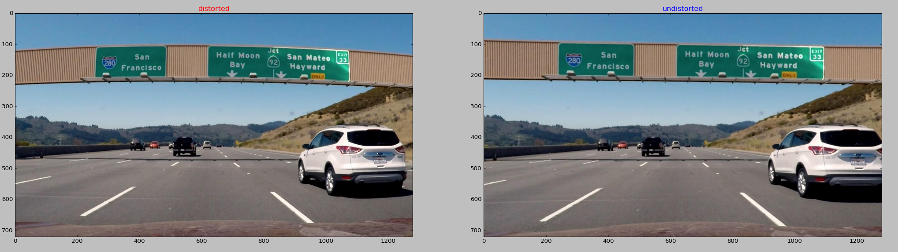

## Advanced Lane Finding
[](http://www.udacity.com/drive)

The Project
---

The goals of this project are the following:

1. Compute the camera calibration matrix and distortion coefficients given a set of chessboard images.
2. Apply a distortion correction to raw images.
3. Use color transforms, gradients, etc., to create a thresholded binary image.
4. Apply a perspective transform to rectify binary image ("birds-eye view").
5. Detect lane pixels and fit to find the lane boundary.
6. Determine the curvature of the lane and vehicle position with respect to center.
7. Warp the detected lane boundaries back onto the original image.
8. Output visual display of the lane boundaries and numerical estimation of lane curvature and vehicle position.


Project files
---

* `calibrator.py` calculates calibration of camera and undistortes video frames or just images.
* `perspective.py` keeps _src_, _dst_ points and perspective transform matrices - standard and inverse a s well.
* `mask.py` gives different mask options for input images.
* `common.py` auxiliary functions that help to debug and produce some visual results.
* `pipeline.py` this module contains classes for frame and video handling.

### Compute the camera calibration matrix and distortion coefficients given a set of chessboard images.
##### Criteria: provide an example of a distortion-corrected image.

To solve camera calibration problem I wrote class that searches chessboard images in target folder by regexp patter and saves found filenames.

```
def find_pictures(cls, pattern='.*\.jpg', directory='.'):
    if not os.path.isdir(directory):
        ## TOOD: log this message
        return []
    regex = re.compile(pattern)
    files = []
    for filename in os.listdir(directory):
        if re.match(string=filename, pattern=regex) is None:
            continue
        files.append(os.path.join(directory, filename))
    if files != []:
        cls._files = files
    return files
```

Then `Calibrator` uses this list to load chessboard images and detects N by M corner coordinates. N is a number of corners in y-axis and M is a number of corner on x-axis. Then using OpenCV `calibrateCamera` method, found points and groundtruth coordinates for corners also known as `objpoints`, the calibrator computes **distortion matrix** and **camera matrix**. This is crusial components which `Calibrator` saves once they were calculated.

```
def calibrate_camera(cls, nx, ny, show=False):
    assert(len(cls._files) != 0)
    objs = np.zeros((nx * ny, 3), dtype=np.float32)
    objs[:,:2] = np.mgrid[0:nx,0:ny].T.reshape(-1, 2)
    n = len(cls._files)
    objpoints = [objs] * n
    imgpoints = []
    for i in range(n):
        img = cv.imread(cls._files[i], cv.IMREAD_COLOR)
        if img is None:
            print('{0} is not an image'.format(cls._files[i]), file=sys.stderr)
            continue
        gray = cv.cvtColor(img, cv.COLOR_BGR2GRAY)
        ret, corners = cv.findChessboardCorners(gray, (nx, ny), None)
        if ret == True:
            imgpoints.append(corners)
            if show == True:
                cv.drawChessboardCorners(img, (nx, ny), corners, ret)
                fig = plt.figure(0)
                fig.canvas.set_window_title('calibrate image #{0}'.format(i))
                plt.imshow(img)
                plt.show()
        elif show == True:
            fig = plt.figure(0)
            fig.canvas.set_window_title('FAILED image #{0}'.format(i))
            plt.imshow(img)
            plt.show()
    nimg = len(imgpoints)
    if nimg > 0:
        shape = img.shape[1], img.shape[0]
        ret, mtx, dist, _rv, _tv = cv.calibrateCamera(
                objpoints[:nimg], imgpoints,
                imageSize=shape, cameraMatrix=None, distCoeffs=None)
        if ret:
            cls._mtx = mtx
            cls._dist = dist
```

**distortion matrix** and **camera matrix** are arguments for OpenCV `undistort` function, which makes process of reconstruction of true image is much easier.

```
def undistort(cls, im, show=False):
     assert(cls._mtx is not None)
     assert(cls._dist is not None)
     undist_im = cv.undistort(im, cls._mtx, cls._dist, None, cls._mtx)
     if show == True:
         fig, ax = plt.subplots(ncols=2, squeeze=True)
         fig.canvas.set_window_title('Distorted/Undistored Image')
         ax[0].imshow(im)
         ax[1].imshow(undist_im)
         ax[0].set_title('distorted', color='r')
         ax[1].set_title('undistorted', color='b')
         fig.tight_layout()
         fig.show()
     return undist_im
```

So, everyting is ready to undistort the test image. You can notice that origin frame has curved billboard with highway markings, but on corrected image it looks straight.



