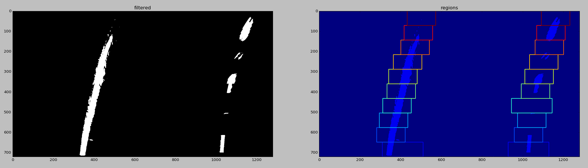
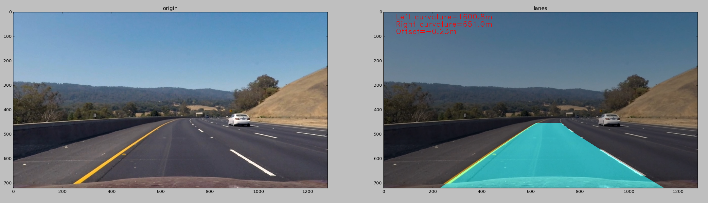

## Advanced Lane Finding
[](http://www.udacity.com/drive)

The Project
---

The goals of this project are the following:

1. Compute the camera calibration matrix and distortion coefficients given a set of chessboard images.
2. Apply a distortion correction to raw images.
3. Use color transforms, gradients, etc., to create a thresholded binary image.
4. Apply a perspective transform to rectify binary image ("birds-eye view").
5. Detect lane pixels and fit to find the lane boundary.
6. Determine the curvature of the lane and vehicle position with respect to center.
7. Warp the detected lane boundaries back onto the original image.
8. Output visual display of the lane boundaries and numerical estimation of lane curvature and vehicle position.


Project files
---

* `calibrator.py` calculates calibration of camera and undistortes video frames or just images.
* `mask.py` gives different mask options for input images.
* `perspective.py` keeps _src_, _dst_ points and perspective transform matrices - standard and inverse a s well.
* sperspectivs.py` keeps _src_, _dst_ points and perspective transform matrices - standard and inverse a s well.
* sperspective.py` keeps _src_, _dst_ points and perspective transform matrices - standard and inverse a s well.
* `common.py` auxiliary functions that help to debug and produce some visual results.
* `pipeline.py` this module contains classes for frame and video handling.

### Compute the camera calibration matrix and distortion coefficients given a set of chessboard images.
#### Criteria: provide an example of a distortion-corrected image.

To solve camera calibration problem I wrote class that searches chessboard images in target folder by regexp patter and saves found filenames.

```python
## calibrator.py
def find_pictures(cls, pattern='.*\.jpg', directory='.'):
    if not os.path.isdir(directory):
        ## TOOD: log this message
        return []
    regex = re.compile(pattern)
    files = []
    for filename in os.listdir(directory):
        if re.match(string=filename, pattern=regex) is None:
            continue
        files.append(os.path.join(directory, filename))
    if files != []:
        cls._files = files
    return files
```

Then `Calibrator` uses this list to load chessboard images and detects N by M corner coordinates. N is a number of corners in y-axis and M is a number of corner on x-axis. Then using OpenCV `calibrateCamera` method, found points and groundtruth coordinates for corners also known as `objpoints`, the calibrator computes **distortion matrix** and **camera matrix**. This is crusial components which `Calibrator` saves once they were calculated.

```python
## calibrator.py
def calibrate_camera(cls, nx, ny, show=False):
    assert(len(cls._files) != 0)
    objs = np.zeros((nx * ny, 3), dtype=np.float32)
    objs[:,:2] = np.mgrid[0:nx,0:ny].T.reshape(-1, 2)
    n = len(cls._files)
    objpoints = [objs] * n
    imgpoints = []
    for i in range(n):
        img = cv.imread(cls._files[i], cv.IMREAD_COLOR)
        if img is None:
            print('{0} is not an image'.format(cls._files[i]), file=sys.stderr)
            continue
        gray = cv.cvtColor(img, cv.COLOR_BGR2GRAY)
        ret, corners = cv.findChessboardCorners(gray, (nx, ny), None)
        if ret == True:
            imgpoints.append(corners)
            if show == True:
                cv.drawChessboardCorners(img, (nx, ny), corners, ret)
                fig = plt.figure(0)
                fig.canvas.set_window_title('calibrate image #{0}'.format(i))
                plt.imshow(img)
                plt.show()
        elif show == True:
            fig = plt.figure(0)
            fig.canvas.set_window_title('FAILED image #{0}'.format(i))
            plt.imshow(img)
            plt.show()
    nimg = len(imgpoints)
    if nimg > 0:
        shape = img.shape[1], img.shape[0]
        ret, mtx, dist, _rv, _tv = cv.calibrateCamera(
                objpoints[:nimg], imgpoints,
                imageSize=shape, cameraMatrix=None, distCoeffs=None)
        if ret:
            cls._mtx = mtx
            cls._dist = dist
```

**distortion matrix** and **camera matrix** are arguments for OpenCV `undistort` function, which makes process of true image reconstruction is much easier. `Calibrator` has special wrapper for it:

```python
## calibrator.py
def undistort(cls, im, show=False):
     assert(cls._mtx is not None)
     assert(cls._dist is not None)
     undist_im = cv.undistort(im, cls._mtx, cls._dist, None, cls._mtx)
     if show == True:
         fig, ax = plt.subplots(ncols=2, squeeze=True)
         fig.canvas.set_window_title('Distorted/Undistored Image')
         ax[0].imshow(im)
         ax[1].imshow(undist_im)
         ax[0].set_title('distorted', color='r')
         ax[1].set_title('undistorted', color='b')
         fig.tight_layout()
         fig.show()
     return undist_im
```

Looks like everyting is ready to undistort the test image. The result you can see in a screenshot below. You can noticethat origin frame has curved billboard with highway markings, but on corrected image it looks straight.

```python
from calibrator import Calibrator as clb
clb.find_pictures(directory="camera_cal", pattern=".*\.jpg")
n, m = 9, 6
clb.calibrate_camera(n, m)
im = common.load_image("vehicles.png")
undistored = clb.undistort(im, show=True)
```


### Apply a perspective transform to rectify binary image ("birds-eye view").
#### Criteria: Describe how (and identify where in your code) you performed a perspective transform and provide an example of a transformed image.

I decided to swap masking and perspective transformation steps, because my experiments showed that applying masks after perspective step reduces noise a lot.

I created another one module that takes responsiblity for managining perspective transformations. All logic is in `Perspective` class in `perspective.py` file. The core principal transformation is transformation matrix. The OpenCV provides valuable function `getPerspectiveTransform`, so that we don't need to worry about out own implementation of perspective transformation, despite that it would quite interesting. The only what we need is source box destination box points. The source rectangle is a region in which we are interested and we would like to see it in bird-eye view. Passing corrdinates of box vertices to `getPerspectiveTransform`, we can get two transformation matrices: _standard_ and _inverse_. The bird-eye view is core principle of advanced lane finding algorithm. Once image is converted to bird-eye view and lanes are detected, for visualization of found lanes we need to transform it back, so, that is a place where _inverse_ matrix plays an important role. The `inverse=[True|False]` argument in `warp` method of `Perspective` class gives you control of what type of matrix you will use.

```python
## perspective.py
@classmethod
def find_perspective(cls, src=None, dst=None):
    cls._src = cls._src if src == None else src
    cls._dst = cls._dst if dst == None else dst
    cls._perspective = cv.getPerspectiveTransform(cls._src, cls._dst)
    cls._perspective_inv = cv.getPerspectiveTransform(cls._dst, cls._src)
@classmethod
def warp(cls, im, inverse=False, show=False):
    assert(cls._perspective is not None)
    assert(cls._perspective is not None)
    imsize = im.shape[1], im.shape[0]
    if inverse == False:
        warped = cv.warpPerspective(im, cls._perspective,
            imsize, flags=cv.INTER_LINEAR)
    else:
        warped = cv.warpPerspective(im, cls._perspective_inv,
            imsize, flags=cv.INTER_LINEAR)
    if show == True:
        pts = np.int32(cls._src).reshape((-1,1,2))
        impoly = cv.polylines(im, [pts], True, (0,255,0))
        show_images(impoly, warped, 'original', 'warped', 'perspective transform')
    return warped
```

Here is coordinates of vertices which are set up by default:

```python
## perspective.py
class Perspective():
    _src = np.float32([[586,455],[698,455],[1120,720],[190,720]])
    _dst = np.float32([[310,0],[1010,0],[1010,720],[310,720]])
    _perspective = None
    _perspective_inv = None
```

This is an example of perspective transformed image by `Perspective.warp` method:

```python
from perspective import Perspective as prsp
prsp.find_perspective()
im = common.load_image("./test_images/test1.jpg")
warped = prsp.warp(im, inverse=False, show=True)
```


### Use color transforms, gradients, etc., to create a thresholded binary image.
#### Criteria: Describe how (and identify where in your code) you used color transforms, gradients or other methods to create a thresholded binary image. Provide an example of a binary image result.

I devoted plenty of time to find best configuration for masking. The result I have gotten is that mask of level and saturation channels with thresholds `[100, 255)` and `[200, 255)` respectively gave me best results. I also found out that green channel with `[200, 255)` and cut magnitude of Sobel can add more stability, especially for top half of the image where all objects are zoomed in and intensities are blurred.

I created a module `mask.py` to perform different types of masks. There are 3 major classes: `CustomMask`, `ColorThresholder` and `SobelMask`. `CustomMask` provides final mask solution for my pipeline.

```python
## mask.py
class CustomMask():
    @staticmethod
    def apply(im, show=False):
        s = ColorThresholder.hls_channel(im, channel='s', thresh=(100, 255))
        l = ColorThresholder.hls_channel(im, channel='l', thresh=(200, 255))
        g = ColorThresholder.rgb_channel(im, channel='g', thresh=(200, 255))
        m = SobelMask.magnitude(im, thresh=(15,255))
        #m = np.zeros(s.shape)
        since = im.shape[0] - (im.shape[0]//2)
        m[since:,:] = 0
        #l = np.zeros(s.shape)
        binary = np.zeros(s.shape)
        binary[(s > 0) | (l > 0) | (g > 0) | (m > 0)] = 1
        if show == True:
            combined = (g == m).astype(np.uint8)
            binary_color = np.dstack([s, l, combined])
            binary_color[binary_color == 1] = 100
            show_images(im, binary_color, 'original', 'binary colored', 'Masking image')
            show_images(im, binary, 'original', 'binary b&w', 'Masking image')
        return binary
```

Below you can find an example of applied `CustomMask`:

```python
from mask import CustomMask as custom_mask
custom_mask.apply(warped)
```

Binary colorful mask. It has saturation, level channes of HLS, and also green channel of RGB, plus thresholded magnitude of sobel:


Binary representation:


### Detect lane pixels and fit to find the lane boundary.
#### Criteria: Describe how (and identify where in your code) you identified lane-line pixels and fit their positions with a polynomial?

I used histogram approach to find relevant pixels for right and left lanes. I decided to concentrate on this approach instead of way to sticking and relying on previous found left and right polynomial lines. I just found that it does add accuracy for my model of finding lanes.


Let's check the code. Below you can see the pipeline of processing a frame. First it takes frame undistortes it, creates a bird-view, applies masks then searches lanes pixels, builds poly lines for found left and right pixels and finally calculates offset and curvature.

```python
## pipeline.py

def process(self, frame, show=False):
    im = clb.undistort(frame);
    warped = prsp.warp(im)
    masked = custom_mask.apply(warped, show=show)
    lp, rp = self._find_lane_points(masked, num_strips=10, radius=70, show=show)
    height = masked.shape[0]
    width = masked.shape[1]
    llane = Lane(lp, end=height-1, num=height)
    rlane = Lane(rp, end=height-1, num=height)
    offset = Lane.offset(llane, rlane, y=masked.shape[0]-1, frame_width=width)
    lcurv = llane.curvature(height // 2)
    rcurv = rlane.curvature(height // 2)
    fill = Lane.fill_lanes(warped, llane, rlane, show=show)
    return self._final_frame(im, fill, lcurv, rcurv, offset, show=show)
```

The warped and masked frame is splitted on 10 equal stripes. Each stripe is divided on two halves along horizont, then sum of pixels along y-axis is taken and using `numpy.argmax()` the peak of histogram is found. Once left and right peaks have been gotten the algorithm produces bound boxes for points which should stay for polynomial fitting. If gotten peaks lie far from previous peaks, it replaces found peaks with old values. 

```python
## pipeline.py
def _find_lane_points(self, im, num_strips=10,
                      radius=80, max_radius=100,
                      peak_diff=60, show=False):
    strip_height = im.shape[0] // num_strips
    heights = [None] * num_strips
    strips = [None] * num_strips
    for i in range(num_strips):
        s, e = i * strip_height, (i+1) * strip_height
        heights[-i-1] = (s, e)
        strips[-i-1] = im[s:e, :]
    ly, lx = [[]] * num_strips, [[]] * num_strips
    ry, rx = [[]] * num_strips, [[]] * num_strips
    nonzeros = np.array(im.nonzero())
    peaks = [None] * num_strips
    if show == True:
        cpy = im.copy()
    lpeak, rpeak = 0, 0
    for i in range(num_strips):
        if i == 0:
            lpeak, rpeak = self._find_peaks(im, mode='argmax')
            lrad, rrad = max_radius, max_radius
        else:
            lpeak_prev, rpeak_prev = peaks[i-1]
            lpeak, rpeak = self._find_peaks(strips[i], mode='argmax')
            if np.abs(lpeak_prev - lpeak) > peak_diff:
                lpeak = lpeak_prev
                lrad = max_radius
            else:
                lrad = radius
            if np.abs(rpeak_prev - rpeak) > peak_diff:
                rpeak = rpeak_prev
                rrad = max_radius
            else:
                rrad = radius
        lbox = ((heights[i][0], lpeak - lrad), (heights[i][1], lpeak + lrad))
        rbox = ((heights[i][0], rpeak - rrad), (heights[i][1], rpeak + rrad))
        peaks[i] = (lpeak, rpeak)
        if show == True:
            top, bot = lbox[0], lbox[1]
            cpy = cv.rectangle(cpy, (top[1], top[0]), (bot[1], bot[0]), (i+1,0,0), 2)
            top, bot = rbox[0], rbox[1]
            cpy = cv.rectangle(cpy, (top[1], top[0]), (bot[1], bot[0]), (i+1,0,0), 2)
        (ly[i], lx[i]), (ry[i], rx[i]) = self._nonzero_points(nonzeros, left=lbox, right=rbox)
    left = (np.concatenate(ly), np.concatenate(lx))
    right = (np.concatenate(ry), np.concatenate(rx))
    if show == True:
        filtered = np.zeros(im.shape[:2])
        filtered[left[0],left[1]] = 1
        filtered[right[0],right[1]] = 1
        show_images(filtered, cpy, 'filtered', 'regions', 'Found points', cmap1='gray')
    return left, right
```

Here is listed auxilary functions. For example `_median_from_distr()` computes median x index of histogram. The `_find_peaks()` can be run in two modes: `median` and `argmax` search of peak. And the `_nonzero_points()` just picks only those pixels which are bounded by left and right rectangle:

```python
## pipeline.py
def _median_from_distr(self, arr):
    return np.median(np.concatenate([[i]*v for i, v in enumerate(arr)]))
def _find_peaks(self, strip_im, mode='argmax'):
    mid = np.int32(strip_im.shape[1] * .5)
    if mode == 'argmax':
        lx = strip_im[:,:mid].sum(axis=0).argmax()
        rx = strip_im[:,mid:].sum(axis=0).argmax()
    elif mode == 'median':
        lx = np.int32(self._median_from_distr(strip_im[:,:mid].sum(axis=0)))
        rx = np.int32(self._median_from_distr(strip_im[:,mid:].sum(axis=0)))
    return lx, rx + mid
def _nonzero_points(self, nonz, left=((0,200),(720,600)), right=((0,800), (720,1200))):
    # lty => left top y
    # ltx => left top x
    # lby => left bottom y
    # lbx => left bottom x
    (lty, ltx), (lby, lbx) = left
    (rty, rtx), (rby, rbx) = right
    l = (nonz[0] >= lty) & (nonz[0] < lby) & (nonz[1] > ltx) & (nonz[1] <= lbx)
    r = (nonz[0] >= rty) & (nonz[0] < rby) & (nonz[1] > rtx) & (nonz[1] <= rbx)
    nonz_l = nonz[:, l]
    nonz_r = nonz[:, r]
    return (nonz_l[0], nonz_l[1]), (nonz_r[0], nonz_r[1])
```

I played a bit with different functions for searching peak of histogram. For e.g. I thought that it would be better to use `median` instead of maximum value, but I got worse results on video with it.

Failed run with median calculation of peaks:


So, final result of histogram and bounding boxes is:



### Warp the detected lane boundaries back onto the original image. Determine the curvature of the lane and vehicle position with respect to center.
#### Criteria 1: Provide an example image of your result plotted back down onto the road such that the lane area is identified clearly.
#### Criteria 2: Describe how (and identify where in your code) you calculated the radius of curvature of the lane and the position of the vehicle with respect to center.

Using gotten left and right pixels of lanes we can build polynomial lines. The class `Lane` adresses all issues with fitting lines, finding cross points with horizontal line, computing curvature and offset.

I use Numpy `pylyfit` function for determining coefficients of second order polynomial line. They are called A, B and C respectively. To restore lane's line on warped image I generated y-axis coordinates and calculated x-axis coordinates by conventional 2nd order line equation `A*x**2 + B*x + C`. The `Lane.cross()` solves this for us. It takes y coordinates and produces x'es using saved coefficients before.

The same `cross()` function is used when we need calculate the curvature and offset of the car from center of the frame. You can check static method `offset()` of Lane class and `curvature()` function of instance Lane class. The major issue that all our calculations are made in pixels space and we need to convert this values to something more presentable for examples meters. For example curvature can be calculated by `(1 + ((A*y * 2) + b)**2)**1.5/(A*2)`. The convertion of pixels to meters in curvature can be done by scale factors: for x-axis it is `3.7/700`, and for y-axis it is `30/720`, where 3.7 and 300 are meters, 700 and 720 are pixels respectively. It means how many meters in one pixel in horizontal and vertical axes. The similar approach is used in offset calculation. We know that standard interval between lanes (in US) is about 3.7 meters. It is very userful information, becase knowing pixel coordinate of left and right lane we are able to calculate the offset distance of the car center from frame center using simple `(frame_width/2 - 1/2*(left_lane_coord + right_lane_coord)) * (3.7/abs(left_lane_coord - right_lane_coord))`.

```python
## pipeline.py
class Lane():
    def __init__(self, points, start=0, end=719, num=720):
        yp, xp = points
        coeff = np.polyfit(yp, xp, 2)
        y = np.linspace(start, end, num)
        self.a = coeff[0]
        self.b = coeff[1]
        self.c = coeff[2]
        self.line = self.a*(y**2) + self.b*y + self.c
        self.coeff = coeff
        self.y = y
    def cross(self, y=0):
        return self.a * (y**2) + self.b * y + self.c
    def curvature(self, y=0):
        x_cm = 3.7 / 700
        y_cm = 30 / 720
        a, b, _ = np.polyfit(self.y * y_cm, self.line * x_cm, 2)
        return (1 + ((a * y * y_cm * 2) + b)**2)**1.5 / (a * 2)
    @staticmethod
    def fill_lanes(im, llane, rlane, fill_color=(0,255,255), show=False):
        y = llane.y
        lp = np.array([np.transpose(np.vstack([llane.line, y]))])
        rp = np.array([np.flipud(np.transpose(np.vstack([rlane.line, y])))])
        points = np.hstack([lp, rp])
        fill = np.zeros_like(im)
        cv.fillPoly(fill, np.int32([points]), fill_color)
        if show == True:
            cpy = im.copy()
            cpy = cv.addWeighted(cpy, 1, fill, 0.2, 0)
            show_images(im, cpy, 'origin', 'filled warp', 'Fill lanes')
        return fill
    @staticmethod
    def offset(llane, rlane, frame_width=0, y=0):
        lx = llane.cross(y)
        rx = rlane.cross(y)
        scale = 3.7 / np.abs(lx - rx)
        center = np.mean([lx, rx])
        return (frame_width/2 - center) * scale
```

That's it, we can fill space between lanes with color, unwarp it by inverse perspective matrix and mix with original image. The final frame is constructed by next peace of code. It just takes curvature and offset metrics, filled with color region within the lanes and puts them all into the original frame image.

```python
def _final_frame(self, im, fill, lcurv, rcurv, offset,
                 font=cv.FONT_HERSHEY_DUPLEX,
                 scale_font=1, color_font=(255,0,0),
                 show=False):
    fill = prsp.warp(fill, inverse=True)
    out = im.copy()
    out = cv.addWeighted(out, 0.7, fill, 0.5, 0)
    xtxt = 50
    lcurv_text = 'Left curvature={0:.01f}m'.format(lcurv)
    rcurv_text = 'Right curvature={0:.01f}m'.format(rcurv)
    offset_text = 'Offset={0:.02f}m'.format(offset)
    out = cv.putText(out, lcurv_text, (xtxt, 30), font, scale_font, color_font)
    out = cv.putText(out, rcurv_text, (xtxt, 60), font, scale_font, color_font)
    out = cv.putText(out, offset_text, (xtxt, 90), font, scale_font, color_font)
    if show == True:
        show_images(im, out, 'origin', 'lanes', 'Lanes detected')
    return out
```

I got this stunning result (of course in comparison with `project #1`):



## Conclusion

In fact, next to this description lies (almost) ready for procuction* code that can be used for processing realtime frame from video stream. Of course, I need to tune some parameters and add more robustness to lane detection and reduce some vibration of lines. There are well known approaches to address this issues. For example, the shaking of lanes can be eliminated by using smoothing coefficients of polynomial lines which where found in previous steps. The standard exponential moving average can be used for that.

Right now, you can test image frame by typing in your `ipython` console, the next code lines:

```python
from calibrator import Calibrator
from perspective import Perspective
import pipeline

Calibrator.find_pictures(directory="camera_cal", pattern=".*\.jpg");
Calibrator.calibrate_camera(9, 6)
Perspective.find_perspective();

p = pipeline.FrameLanePipeline()
new_im = p.process(im, show=True)
```

And you can run it against video:

```python
from calibrator import Calibrator
from perspective import Perspective
import pipeline

Calibrator.find_pictures(directory="camera_cal", pattern=".*\.jpg");
Calibrator.calibrate_camera(9, 6)
Perspective.find_perspective();

v = pipeline.VideoLanePipeline()
v.process("./project_video.mp4", "output.mp4")
```
## Video:

[Link to the project video](https://drive.google.com/file/d/0B90SlGxx-BAeU1lwYnZpbjEwOFk/view?usp=sharing)
